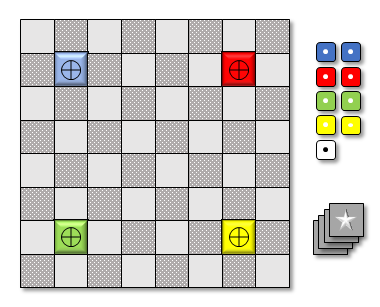

# Praxis

*Praixs* is a turn-based board game relying on regular 6 faces dices and their mutations. The actual capacities of a cube is represented by its top face. The cubes move of a board made of squared tiles, can fight each other, and can modify the surrounding tiles. A mutation occurs when a cube moves on a mutating tile.

This is a work in progress!

If you intent to derive or to sell either a text, a product or a software from this work, then read the [**LICENSE**](./docs/LICENSE.md) document. 

